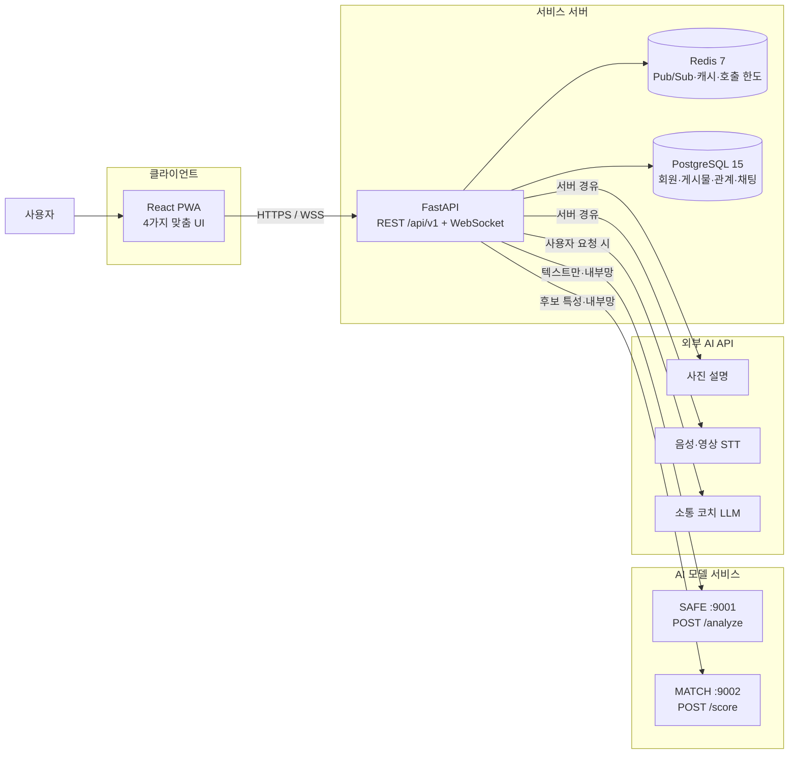
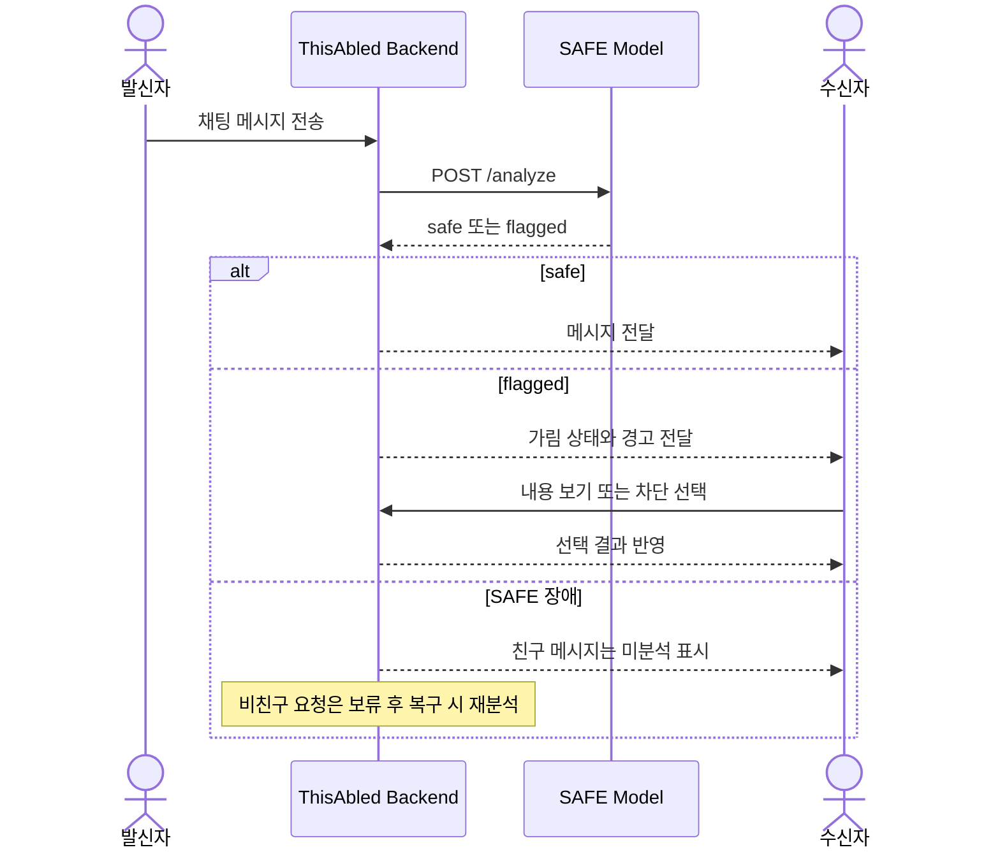

# 26_HS073

<div align="center">


# ThisAbled

### 장애인 맞춤형 AI 소셜 커뮤니티 플랫폼

2026 한이음 드림업 · 팀 삼기니

<p>
  
  
  
  
  
  
</p>

</div>

---

## 1. 프로젝트 개요

### 1-1. 프로젝트 소개

- **프로젝트명:** 장애인 맞춤형 AI 소셜 커뮤니티 플랫폼
- **서비스명:** ThisAbled
- **팀명:** 삼기니
- **프로젝트 번호:** `26_HS073`
- **프로젝트 정의:** 시각·청각·발달장애인과 비장애인이 각자에게 맞는 화면으로 함께 소통하고, AI 접근성 기능과 위험 메시지 안내를 통해 안전하게 관계를 형성하는 모바일 우선 소셜 커뮤니티
- **프로젝트 기간:** 2026. 4. 1. - 2026. 10. 30.

ThisAbled는 이용자가 온보딩에서 선택한 환경에 따라 시각·청각·발달·기본 모드를 제공합니다. 모든 모드는 같은 게시물·친구·채팅 데이터를 공유하지만 화면 대비, 정보량, 자막, 음성 입력과 안내 방식은 이용 환경에 맞게 달라집니다.

AI는 사용자를 대신해 게시하거나 대화를 자동으로 제재하지 않습니다. 추천 문구는 사용자가 확인·수정한 뒤에만 반영되고, 위험 가능성이 있는 메시지는 수신자에게 경고와 가림 상태로 표시하여 열람·차단 여부를 직접 선택할 수 있게 합니다.

### 1-2. 개발 배경 및 필요성

온라인 커뮤니티는 관계를 만들고 정보를 얻는 중요한 공간이지만, 범용 서비스는 다음 문제를 동시에 해결하지 못합니다.

- 이미지 중심 게시물은 시각장애 사용자가 내용을 파악하기 어렵습니다.
- 음성 중심 영상과 알림은 청각장애 사용자에게 충분한 정보를 전달하지 못합니다.
- 복잡한 문장과 다단계 화면은 발달장애 사용자의 이용을 어렵게 합니다.
- 신고 이후 대응에 집중된 기존 구조로는 금전 요구, 그루밍, 괴롭힘과 같은 위험 메시지를 수신 전에 안내하기 어렵습니다.
- 접근성 도구와 커뮤니티가 분리되면 장애 유형별로 이용 공간이 다시 나뉘게 됩니다.

ThisAbled는 **접근성·관계 형성·온라인 안전을 하나의 커뮤니티 흐름에 결합**해 이 문제를 해결하고자 합니다.

### 1-3. 프로젝트 특장점

1. **하나의 관계망, 네 가지 이용 환경**  
   시각·청각·발달·기본 모드가 같은 피드·친구·채팅을 공유하여 이용자를 별도 서비스로 분리하지 않습니다.

2. **수신 전에 작동하는 AI 안심 채팅**  
   자체 학습한 한국어 안전 모델이 1:1 채팅 텍스트를 분석합니다. 주의 메시지는 수신자에게 가려서 보여주며 원문 열람과 차단은 사용자가 결정합니다.

3. **관계 단위 보호 정책**  
   비친구의 첫 메시지는 요청함에 보류하고, 미성년자에게는 더 민감한 안전 임계값을 적용합니다. 같은 상대에게 주의 메시지가 반복되면 관계 단위 전송 제한을 생성합니다.

4. **설명 가능한 친구 추천**  
   자기소개·관심사·연령대 등의 신호로 친구 후보를 랭킹하고, 관심사나 소개 유사성과 같이 사용자가 이해할 수 있는 추천 사유를 제공합니다. UI 모드 정보는 추천 사유에 노출하지 않습니다.

5. **AI 장애가 기본 기능을 막지 않는 구조**  
   SAFE·MATCH를 백엔드와 분리된 FastAPI 서비스로 운영합니다. 모델 장애 시에도 정책에 따라 미분석·보류·재분석 상태를 명시해 기본 소통 흐름을 유지합니다.

### 1-4. 주요 기능

| 영역 | 주요 기능 | 구현 상태 |
| --- | --- | :---: |
| 맞춤 UI | 시각·청각·발달·기본 모드, 모드 변경 | 구현 |
| 커뮤니티 | 전체 피드, 게시물, 사진·영상, 댓글, 좋아요 | 구현 |
| 관계 | AI 친구 추천, 친구 요청·수락·거절, 차단 | 구현 |
| 실시간 소통 | WebSocket 기반 1:1 채팅, 비친구 요청함, 읽음 상태 | 구현 |
| AI 안심 채팅 | 정상·주의 판정, 메시지 가림, 소급 재분석, 반복 전송 제한 | 구현 |
| AI 소통 코치 | 쉬운 문장, 문장 완성, 댓글·답장 후보, 대화 힌트 | 구현 |
| 콘텐츠 접근성 | 사진 설명·TTS, 업로드 영상 자동 자막, 음성 입력 | 구현 |
| 알림 | 인앱 알림, 모드별 시각·음성 안내 | 구현 |

### 1-5. 기대 효과 및 활용 분야

#### 기대 효과

- 장애 유형별 온라인 이용 장벽 완화
- 하나의 커뮤니티 안에서 장애인과 비장애인의 관계 형성 지원
- 위험 메시지에 대한 수신 전 안내와 사용자 대응 선택 지원
- 이미지 설명·자동 자막·쉬운 문장을 통한 콘텐츠 접근성 개선
- 접근성 UI와 AI 안전 모듈의 다른 디지털 취약계층 서비스 확장

#### 활용 분야

- 장애인복지관 및 자립생활센터의 온라인 소통 프로그램
- 장애인권익옹호기관의 온라인 피해 예방 교육
- 접근성 기능이 필요한 지역 커뮤니티
- 고령층·다문화 가정 등 쉬운 정보 제공이 필요한 서비스

### 1-6. 기술 스택

| 구분 | 기술 |
| --- | --- |
| Frontend | React 19, TypeScript 6, Vite 8, Tailwind CSS 4, Zustand, PWA |
| Backend | Python 3.11, FastAPI 0.141.1, SQLAlchemy 2.0, Alembic, asyncpg |
| Database | PostgreSQL 15, Redis 7 |
| AI - SAFE | KcELECTRA, PyTorch, transformers, 규칙 보조 레이어 |
| AI - MATCH | ko-sroberta, sentence-transformers, LightGBM LambdaMART |
| AI - 접근성 | 이미지 설명 모델, STT, TTS, 외부 LLM API |
| Infra | Docker Compose, GitHub Actions, Hugging Face Hub, HTTPS/WSS |
| Test | pytest, pytest-asyncio, Playwright, 모델 평가·서빙 smoke test |
| Collaboration | GitHub, Notion, Discord, Google Meet, Figma |

### 구현·검증 결과

| 항목 | 결과 | 해석 |
| --- | ---: | --- |
| SAFE 주의 Recall | 0.859 | 실데이터 홀드아웃 5,491건, 성인 임계값 0.5 |
| SAFE 정상 Precision | 0.752 | 정상 메시지 과도한 가림 점검 |
| SAFE Macro-F1 | 0.775 | 정상·주의 이진 분류 |
| SAFE CPU 중앙 지연 | 약 48ms | 백엔드 2초 제한 안에서 동작 |
| MATCH NDCG@10 | 0.7967 | 배포 CPU 독립 재평가 |
| MATCH 후보 20명 p95 | 303.8ms | 온라인 추천 요청 기준 |
| MATCH UI 모드별 DP 차이 | 0.0102 | 합성 사용자 평가이며 실제 사용자 검증 필요 |

> MATCH 공정성 수치는 합성 사용자 기반 점검 결과입니다. 실제 장애 당사자 만족도나 서비스 효과를 의미하지 않으며, 실제 사용자 평가를 후속 과제로 둡니다.

---

## 2. 팀원 소개

| GitHub | 담당 역할 | 주요 담당 저장소 |
| --- | --- | --- |
| [@mi-noong](https://github.com/mi-noong) | 프런트엔드, 장애 유형별 UI/UX, PWA·접근성 기능 | [`thisabled-frontend`](https://github.com/threeGuineas/thisabled-frontend) |
| [@coketazo](https://github.com/coketazo) | 백엔드, REST·WebSocket API, 데이터베이스·인프라 | [`thisabled-backend`](https://github.com/threeGuineas/thisabled-backend) |
| [@soyuncj](https://github.com/soyuncj) | AI 모델, 데이터 파이프라인, 평가·모델 서빙 | [`thisabled-ai`](https://github.com/threeGuineas/thisabled-ai) |

---

## 3. 시스템 구성도

### 3-1. 서비스 구성도



### 3-2. AI 안심 채팅 흐름



### 3-3. 저장소 구성

| 저장소 | 역할 | 기준 커밋 |
| --- | --- | --- |
| [`thisabled-frontend`](https://github.com/threeGuineas/thisabled-frontend) | 모바일 우선 PWA, 맞춤 UI, 피드·친구·채팅 화면 | `a8d5ff5` |
| [`thisabled-backend`](https://github.com/threeGuineas/thisabled-backend) | REST·WebSocket API, DB, 인증, 안전·추천 정책 | `d323084` |
| [`thisabled-ai`](https://github.com/threeGuineas/thisabled-ai) | SAFE·MATCH 학습·평가·FastAPI 서빙 | `8077a14` |

---

## 4. 작품 소개영상

아래 이미지를 누르면 ThisAbled 시연 영상을 확인할 수 있습니다.

[](https://www.youtube.com/watch?v=nGfxFitmWmg)

- 영상 링크: <https://www.youtube.com/watch?v=nGfxFitmWmg>

---

## 5. 핵심 소스코드

### 5-1. 선택한 이용 환경에 따른 화면 전환

온보딩에서 선택한 `ui_mode`에 따라 각 사용자에게 적합한 홈 화면을 제공합니다.

```tsx
const homeScreenFor = (mode: DisabilityType): Screen => {
  if (mode === 'default') return 'defaultHome'
  if (mode === 'hearing') return 'hearingHome'
  if (mode === 'developmental') return 'developmentalHome'
  return 'blindHome'
}
```

- 원본: [`thisabled-frontend/src/App.tsx`](https://github.com/threeGuineas/thisabled-frontend/blob/main/src/App.tsx)

### 5-2. 안전 모델의 독립 서비스 경계

백엔드는 안전 모델을 HTTP 서비스로 분리해 호출합니다. 모델 장애나 제한 시간을 별도 예외로 전환하여 친구·비친구 메시지에 정의된 장애 대응 정책을 적용합니다.

```python
class SafetyClient:
    async def analyze(self, text: str, *, receiver_is_minor: bool) -> str:
        try:
            async with httpx.AsyncClient(
                timeout=settings.SAFETY_TIMEOUT_SECONDS
            ) as http:
                resp = await http.post(
                    f"{settings.SAFETY_MODEL_URL}/analyze",
                    json={
                        "text": text,
                        "receiver_is_minor": receiver_is_minor,
                    },
                )
                resp.raise_for_status()
                verdict = resp.json().get("verdict")
        except httpx.HTTPError as exc:
            raise SafetyUnavailable() from exc

        if verdict not in ("safe", "flagged"):
            raise SafetyUnavailable()
        return verdict
```

- 원본: [`thisabled-backend/app/services/safety.py`](https://github.com/threeGuineas/thisabled-backend/blob/main/app/services/safety.py)

### 5-3. 성인·미성년 수신자별 위험 임계값

위험 클래스 확률을 합산하고, 미성년 수신자에게 더 민감한 임계값을 적용합니다. 금전 사기 규칙은 모델 판정에 OR 방식으로만 결합합니다.

```python
@app.post("/analyze")
async def analyze(body: AnalyzeIn):
    probs = _infer(body.text)
    p_risk = sum(probs[1:])
    threshold = THRESHOLD_MINOR if body.receiver_is_minor else THRESHOLD
    rule_hit = _rule_hit(body.text)
    verdict = "flagged" if (p_risk >= threshold or rule_hit) else "safe"
    return {
        "verdict": verdict,
        "rule_assist": rule_hit,
        "risk_prob": round(p_risk, 4),
    }
```

- 원본: [`thisabled-ai/serving/safety_server/app.py`](https://github.com/threeGuineas/thisabled-ai/blob/main/serving/safety_server/app.py)

### 5-4. 추천 후보 보호와 추천 사유 필터링

추천 전에 자신·친구·차단 상대·최근 거절 상대를 제외합니다. UI 모드나 장애 특성이 사용자에게 표시되는 추천 사유에 포함되지 않도록 방어적으로 필터링합니다.

```python
_FORBIDDEN_REASON_WORDS = ("장애", "모드", "시각", "청각", "발달")

def sanitize_reasons(reasons: list[str]) -> list[str]:
    return [
        reason
        for reason in reasons
        if not any(word in reason for word in _FORBIDDEN_REASON_WORDS)
    ]
```

- 원본: [`thisabled-backend/app/services/match.py`](https://github.com/threeGuineas/thisabled-backend/blob/main/app/services/match.py)

---

## 실행 방법

세 저장소를 같은 상위 디렉터리에 내려받으면 Docker Compose가 백엔드와 AI 서비스 경계를 함께 구성할 수 있습니다.

```bash
git clone https://github.com/threeGuineas/thisabled-frontend.git
git clone https://github.com/threeGuineas/thisabled-backend.git
git clone https://github.com/threeGuineas/thisabled-ai.git
```

### 프런트엔드

```bash
cd thisabled-frontend
npm install
cp .env.example .env.development
npm run dev
```

### 백엔드·AI 서비스

```bash
cd thisabled-backend
cp .env.example .env
docker compose up --build
```

실제 API 키, 데이터베이스 비밀번호, Hugging Face 토큰은 저장소에 올리지 않고 `.env`에서 관리합니다. 모델 가중치와 원천 데이터도 각 라이선스 및 보안 정책에 따라 별도 저장합니다.

---

## 한계 및 후속 계획

- SAFE의 금전 사기 탐지는 규칙 보조 의존도를 낮추기 위한 실제 사례 확장이 필요합니다.
- MATCH 성능과 공정성 평가는 합성 사용자 비중이 있으므로 실제 사용자 기반 검증이 필요합니다.
- 장애 유형별 당사자 테스트를 통해 과업 성공률, 화면 탐색, 안내 이해도와 재사용 의향을 점검할 예정입니다.

---

## 라이선스 및 데이터 유의사항

현재 프로젝트 코드는 별도 `LICENSE`가 지정되지 않았습니다. 저장소 공개가 자유로운 상업 이용이나 재배포 허용을 의미하지 않습니다. 공개 데이터셋·사전학습 모델·외부 API는 각각의 원 라이선스와 이용약관을 따릅니다.
